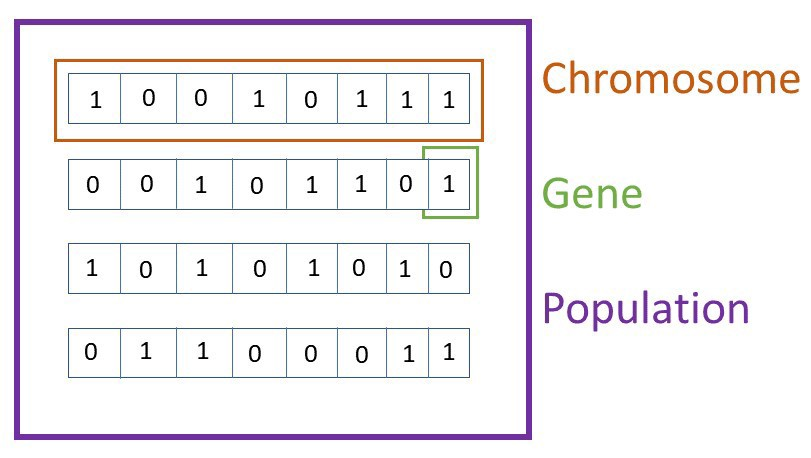

# GENETIC_OPTIMIZATION
Our project is a modelization one used to ease genetic and optimization issues...

## Purposes :
The straight goal of optimization genetic algorithms is to get an approached solution on a problem where an exact solving method can't either be found at all or be found in a reasonable duration.

## Domains :
Optimization Algorithms are also part of Evolutionnary algorithms and can be applied in so many differents areas such as Bioinformatique, Phylogeny , Economy, numeric Sciences, Robotic, Industry, Mathematics, Physics, chemistry and so on...

## Concept :
In our case, the modelization is used in the biogeneration field.

## Brief Description :

In order to conceptualize the problem, we are going to make some assumptions like a Bit a feature value -- an its position a feature type. Also An individual is made up of multiples features, that's why an individual will be a linkedList of bit. Finally a population will be a sequence of Individuals, so a Linked list of a linked list of bit.  
<strong>The purpose of this experiment is to sort out the best individual among a population</strong>

## Technologies used in the projet
-C;  
-Cmake; 
-AGILESCRUM; 
-OOP, Recursivity... 

## How to use the program?
The executable file generated is genetic.exe. In order to launch it you have to: 
-Download the complete project GENETIC_OPTIMIZATION; 
-Unzip it and open the directory GENETIC_OPTIMIZATION with the command (cmd, powershell,...); 
-execute <i> cd PROJET/EXECUTABLE/ </i>; 
-run the program using the line <i> .\genetic </i>. 
 

The executable file(genetic.exe) was generated with a certain number of values defined as constants in the beginning. You can update them if you want and re-build the projet using cmake in order to make your changes be applied. You need to go throught the following steps: 
-Download the complete project GENETIC_OPTIMIZATION; 
-Download and install Cmake, at least the 3.20 VERSION; 
-Unzip the project and open the full project with an IDE; 
-go to "GENETIC_OPTIMIZATION/PROJET/CODE_C" , here are all the sources files; 
-Make all your changes according to your purpose; 
-then go to "GENETIC_OPTIMIZATION/PROJET/Makefiles"; 
-run <i>cmake -G "MinGW Makefiles"</i>; 
-run <i>cmake --build ./</i>; 
-open the directory "GENETIC_OPTIMIZATION/PROJET/EXECUTABLE" with a command line; 
-run the program using the line <i> .\genetic </i>. 
 
